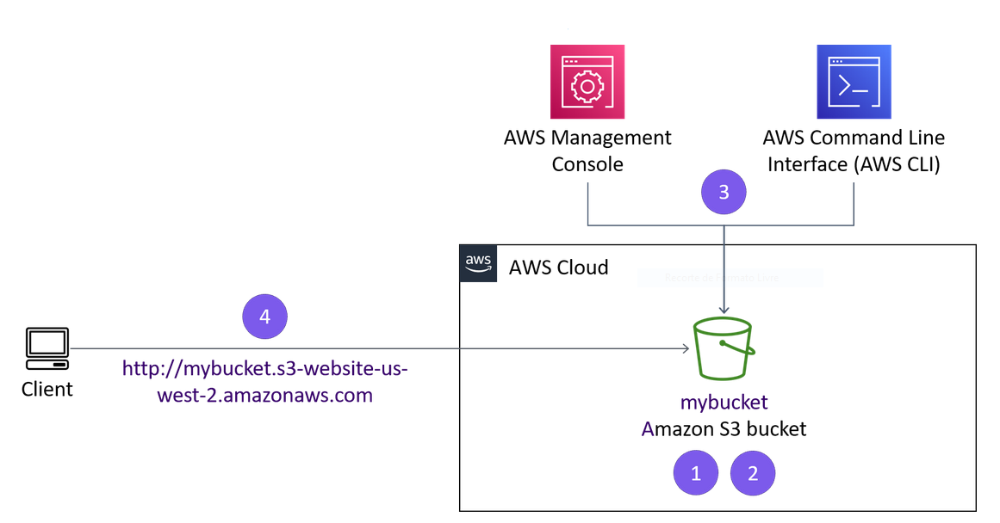
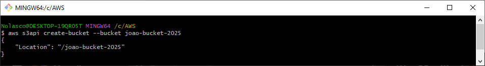
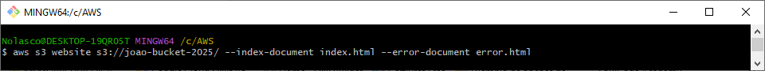
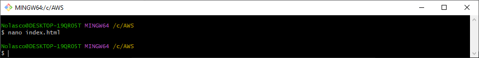
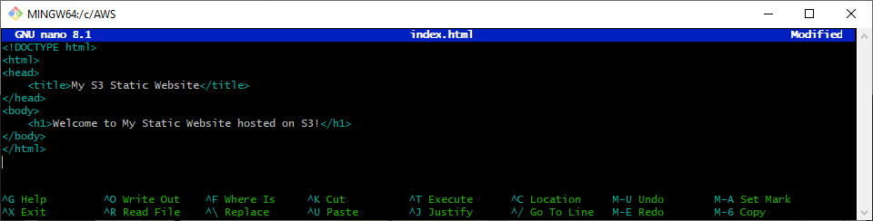
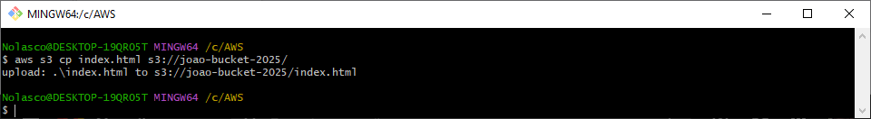
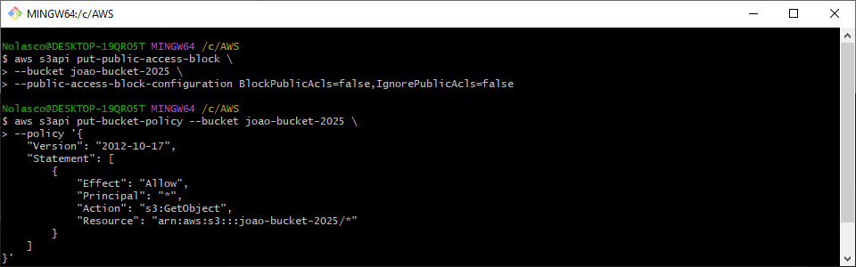
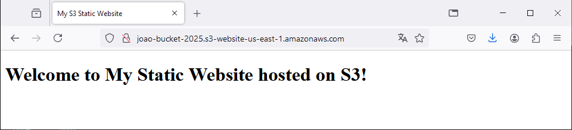
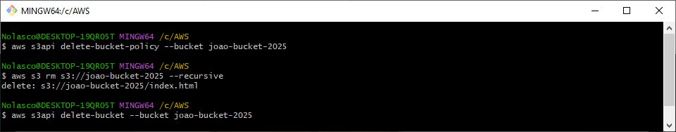

# AWS Hosting a Website on S3

<div align="center">
  
</div>

## Overview
Host a static website on S3 by creating and configuring an S3 bucket for public access.

 to access the automated version with shell scripts.

---
⚠️ **Attention:**
- All the tasks will be completed via the command line using AWS CLI. Ensure you have the necessary permissions. [Install AWS CLI](https://docs.aws.amazon.com/cli/latest/userguide/getting-started-install.html)
- Charges may apply for completing this lab. [AWS Pricing](https://aws.amazon.com/pricing/)
---

## Step 1: Create an S3 bucket
```bash
aws s3api create-bucket --bucket mybucket 
```
Replace `mybucket` with your desired bucket name. The bucket name must be globally unique.

<div align="center">
  
</div>

---

## Step 2: Enable static website hosting for the bucket
```bash
aws s3 website s3://mybucket/ --index-document index.html --error-document error.html
```
Replace `mybucket` with your bucket name.


<div align="center">
  
</div>

---

## Step 3: Create a simple index.html file

<div align="center">
  
</div>

```html
<!DOCTYPE html>
<html>
<head>
    <title>My S3 Static Website</title>
</head>
<body>
    <h1>Welcome to My Static Website hosted on S3!</h1>
</body>
</html>
```

<div align="center">
  
</div>

---

## Step 4: Upload the index.html file to S3
```bash
aws s3 cp index.html s3://mybucket/
```
Replace `mybucket` with your bucket name.


<div align="center">
  
</div>

---

## Step 5: Configure bucket policy for public access
```bash
aws s3api put-public-access-block \
  --bucket <bucket-name> \
  --public-access-block-configuration BlockPublicAcls=false,IgnorePublicAcls=false
```
```bash
aws s3api put-bucket-policy --bucket mybucket --policy '{
    "Version": "2012-10-17",
    "Statement": [
        {
            "Effect": "Allow",
            "Principal": "*",
            "Action": "s3:GetObject",
            "Resource": "arn:aws:s3:::mybucket/*"
        }
    ]
}'
```
Replace `mybucket` with your bucket name.

<div align="center">
  
</div>

---

## Step 6: Access the website
```bash
http://mybucket.s3-website-us-east-1.amazonaws.com
```
Replace `mybucket` with your bucket name.
Replace `us-east-1` with the region you used in Step 1

<div align="center">
  
</div>

---

## Step 7: Clean Up Resources
#### Remove S3 Bucket Policy:
```bash
aws s3api delete-bucket-policy --bucket mybucket
```
#### Delete All Objects from S3 Bucket:
```bash
aws s3 rm s3://mybucket --recursive
```
#### Delete S3 Bucket:
```bash
aws s3api delete-bucket --bucket mybucket
```

- Replace `mybucket` with your bucket name.

<div align="center">
  
</div>
