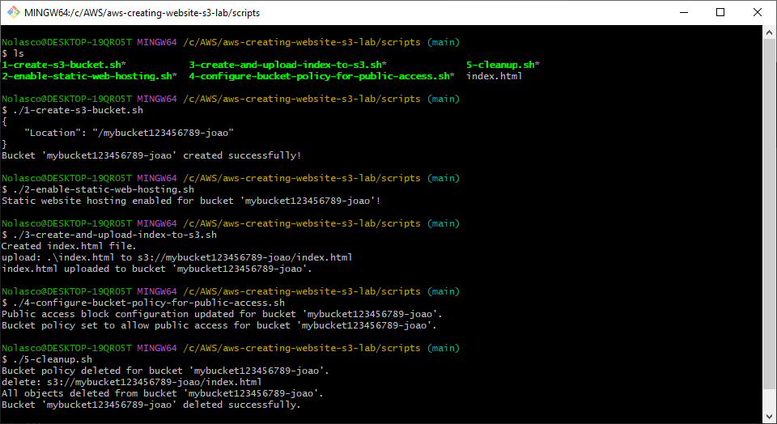

## Overview
You can execute these scripts as an alternative to manual resource creation in the AWS Management Console. 

## Execution Order

Please run the scripts in the following order:
- Edit the scripts according to your needs before running them

1. **Create an S3 bucket:**
```bash
1-create-s3-bucket.sh
```

---

2. **Enable static website hosting for the bucket:**
```bash
2-enable-static-web-hosting.sh
```

---

3. **Create a simple index.html file and upload it to S3:**
```bash
3-create-and-upload-index-to-s3.sh
```

---

4. **Configure bucket policy for public access:**
```bash
4-configure-bucket-policy-for-public-access.sh
```

---

- Access the website before proceeding to Step 5:
```bash
http://mybucket.s3-website-us-east-1.amazonaws.com
```
Replace `mybucket` with your bucket name.
Replace `us-east-1` with the region you used in Step 1

---

5. **Clean Up Resources:**
```bash
5-cleanup
```

<div align="center">
  
</div>


